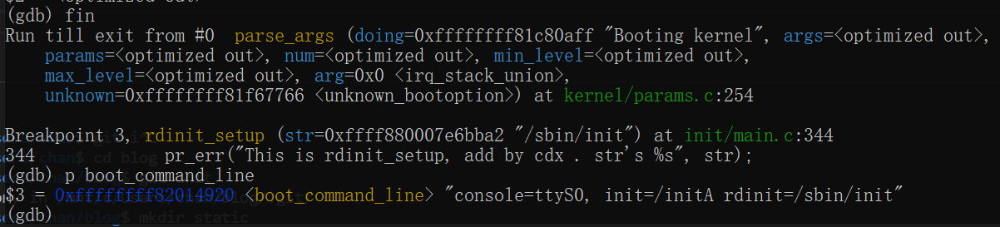

create: 2022/3/3 22:41

update: 2022/3/4 23:26

# cmdline的解析

```c
early_param("debug", debug_kernel);
early_param("quiet", quiet_kernel);

static int __init loglevel(char *str)
{
	int newlevel;

	/*
	 * Only update loglevel value when a correct setting was passed,
	 * to prevent blind crashes (when loglevel being set to 0) that
	 * are quite hard to debug
	 */
	if (get_option(&str, &newlevel)) {
		console_loglevel = newlevel;
		return 0;
	}

	return -EINVAL;
}

early_param("loglevel", loglevel);
```

这是什么魔法吗？。。#TODO
```c
/*
 * Only for really core code.  See moduleparam.h for the normal way.
 *
 * Force the alignment so the compiler doesn't space elements of the
 * obs_kernel_param "array" too far apart in .init.setup.
 */
#define __setup_param(str, unique_id, fn, early)			\
	static const char __setup_str_##unique_id[] __initconst		\
		__aligned(1) = str; 					\
	static struct obs_kernel_param __setup_##unique_id		\
		__used __section(.init.setup)				\
		__attribute__((aligned((sizeof(long)))))		\
		= { __setup_str_##unique_id, fn, early }

#define __setup(str, fn)						\
	__setup_param(str, fn, fn, 0)
/*
 * NOTE: fn is as per module_param, not __setup!
 * Emits warning if fn returns non-zero.
 */
#define early_param(str, fn)						\
	__setup_param(str, fn, fn, 1)
```

>/home/chan/official/linux/include/asm-generic/vmlinux.lds.h
>
>  394,18: 		VMLINUX_SYMBOL(__start___param) = .;			\

```c
	/* Built-in module parameters. */				\
	__param : AT(ADDR(__param) - LOAD_OFFSET) {			\
		VMLINUX_SYMBOL(__start___param) = .;			\
		*(__param)						\
		VMLINUX_SYMBOL(__stop___param) = .;			\
	}								\
```

#TODO 看下__start__param是在何处，在什么时候初始化的，以及模块如何使用这个结构。

# PID=1?
碰到了起init的时候报了-8……所以看下init是咋来的。

我的/init... 很明显它是个脚本。。后来才意识到这个不对
```sh
#/bin/busybox sh
set -x
mount -t proc none /proc
mount -t sysfs none /sys

exec /sbin/init
```
想看下pid1是啥，结果ps空的，proc没挂上。。挂上后看到是/init... 就蛮怪的
```
/ # mount -t proc none /proc
/ # realpath /proc/1/cwd
/
/ # cat /proc/1/cmdline
init[  258.931358] cat (965) used greatest stack depth: 13832 bytes left
/ #
```

来看代码,
`kernel_init`中 先判定了ramdisk_execute_command,若失败则使用execute_command.
而前者在kernel_init_freeable中先判定了ramdisk_execute_command=${ramdisk_execute_command:='/init'}
```c
// init/main.c
	if (*ramdisk_execute_command*) {
		ret = run_init_process(ramdisk_execute_command);
		if (!ret)
			return 0;
		pr_err("Failed to execute %s (error %d)\n",
		       ramdisk_execute_command, ret);
	}

	/*
	 * We try each of these until one succeeds.
	 *
	 * The Bourne shell can be used instead of init if we are
	 * trying to recover a really broken machine.
	 */
	if (execute_command) {
		ret = run_init_process(execute_command);
		if (!ret)
			return 0;
		panic("Requested init %s failed (error %d).",
		      execute_command, ret);
	}
	if (!try_to_run_init_process("/sbin/init") ||
	    !try_to_run_init_process("/etc/init") ||
	    !try_to_run_init_process("/bin/init") ||
	    !try_to_run_init_process("/bin/sh"))
		return 0;

	panic("No working init found.  Try passing init= option to kernel. "
	      "See Linux Documentation/init.txt for guidance.");

static int run_init_process(const char *init_filename)
{
	argv_init[0] = init_filename;
	return do_execve(getname_kernel(init_filename),
		(const char __user *const __user *)argv_init,
		(const char __user *const __user *)envp_init);
}
```

显然的，`execute_command`是个executable不可以是脚本，一开始从-8也可以看出来，而且裸了个内核没解释器什么的
```
#define	ENOEXEC		 8	/* Exec format error */
```

那为啥执行/init失败以后pid1是/init而非/sbin, /etc, /bin下面的init呢。。

看下execute_command, ramdisk_execute_command咋设置的。。

```c
static int __init init_setup(char *str)
{
	unsigned int i;

	execute_command = str; 
	/*
	 * In case LILO is going to boot us with default command line,
	 * it prepends "auto" before the whole cmdline which makes
	 * the shell think it should execute a script with such name.
	 * So we ignore all arguments entered _before_ init=... [MJ]
	 */
	for (i = 1; i < MAX_INIT_ARGS; i++)
		argv_init[i] = NULL;
	return 1;
}
__setup("init=", init_setup);

static int __init rdinit_setup(char *str)
{
	unsigned int i;
	pr_err("This is rdinit_setup, add by cdx . str's %s", str);
	ramdisk_execute_command = str;
	/* See "auto" comment in init_setup */
	for (i = 1; i < MAX_INIT_ARGS; i++)
		argv_init[i] = NULL;
	return 1;
}
__setup("rdinit=", rdinit_setup);
```

有点眼熟，好像是cmdline解析那边的，试一下


不过pid1 还是/init... 为啥。 但是从启动日志看，

```bash
can't run '/etc/init.d/rcS': No such file or directory
```

```c
// from busybox init.c
/* Default sysinit script. */
#ifndef INIT_SCRIPT
# define INIT_SCRIPT  "/etc/init.d/rcS"
#endif
```

执行的是busybox init没错了，把/init删掉以后果然也没什么变化。。

大概跟busybox的init有什么关系吧。

可以看到有个宏。。
```c
//config:config FEATURE_INIT_MODIFY_CMDLINE
//config:	bool "Clear init's command line"
//config:	default y
//config:	depends on INIT || LINUXRC
//config:	help
//config:	*When launched as PID 1 and after parsing its arguments, init*
//config:	*wipes all the arguments but argv[0] and rewrites argv[0] to*
//config:	*contain only "init", so that its command line appears solely as*
//config:	*"init" in tools such as ps.*
//config:	If this option is set to Y, init will keep its original behavior,
//config:	otherwise, all the arguments including argv[0] will be preserved,
//config:	be they parsed or ignored by init.
//config:	The original command-line used to launch init can then be
//config:	retrieved in /proc/1/cmdline on Linux, for example.
```

这个特性让args变成了`init`， 而执行的时候workdir没有理由不是`/` 所以最后的显示就都是`/init`了。

```c
#if ENABLE_FEATURE_INIT_MODIFY_CMDLINE
	/* Make the command line just say "init"  - that's all, nothing else */
	strncpy(argv[0], "init", strlen(argv[0]));
	/* Wipe argv[1]-argv[N] so they don't clutter the ps listing */
	while (*++argv)
		nuke_str(*argv);
#endif

void FAST_FUNC nuke_str(char *str)
{
	if (str) {
		while (*str)
			*str++ = 0;
		/* or: memset(str, 0, strlen(str)); - not as small as above */
	}
}
```

嗯。。还自己做了memset……，检查选项也确实开了，就不验证了。。

好像内核里面也有个override的设定，看看。

	config CMDLINE_OVERRIDE
		bool "Built-in command line overrides boot loader arguments"
		depends on CMDLINE_BOOL
		---help---
		Set this option to 'Y' to have the kernel ignore the boot loader
		command line, and use ONLY the built-in command line.

		This is used to work around broken boot loaders.  This should
		be set to 'N' under normal conditions.

	526 CONFIG_CMDLINE_BOOL=y
	527 CONFIG_CMDLINE=""
	528 CONFIG_CMDLINE_OVERRIDE=y

这override成啥。。

```c
#ifdef CONFIG_CMDLINE_OVERRIDE
	strlcpy(boot_command_line, builtin_cmdline, COMMAND_LINE_SIZE);
#else
	if (builtin_cmdline[0]) {
		/* append boot loader cmdline to builtin */
		strlcat(builtin_cmdline, " ", COMMAND_LINE_SIZE);
		strlcat(builtin_cmdline, boot_command_line, COMMAND_LINE_SIZE);
		strlcpy(boot_command_line, builtin_cmdline, COMMAND_LINE_SIZE);
	}
#endif

#ifdef CONFIG_CMDLINE_BOOL
static char __initdata builtin_cmdline[COMMAND_LINE_SIZE] = CONFIG_CMDLINE;
#endif
```

空的。。 那没事了。